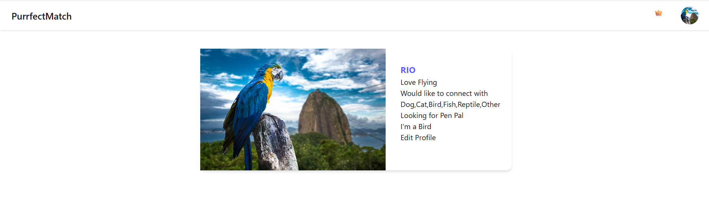
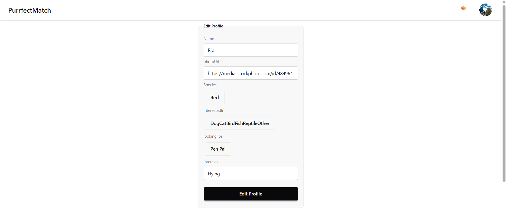
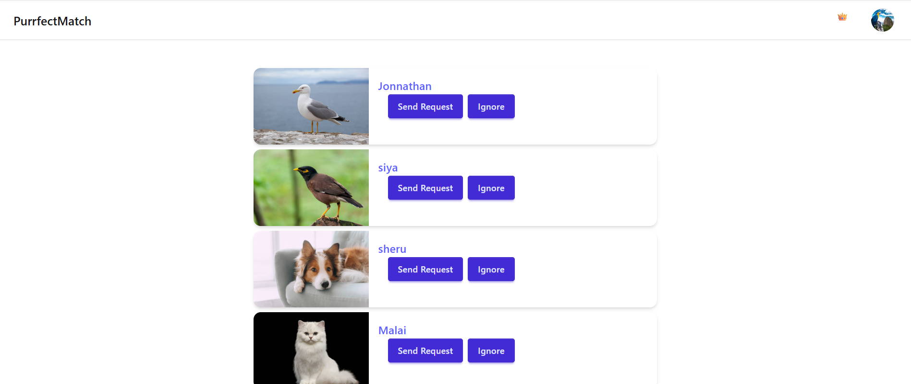
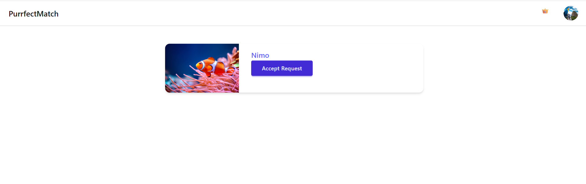
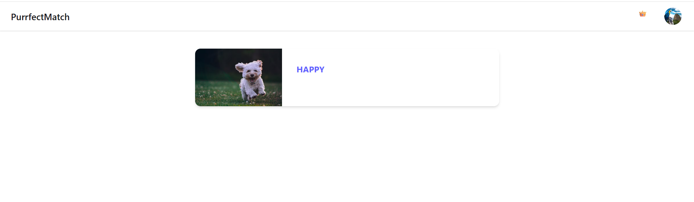
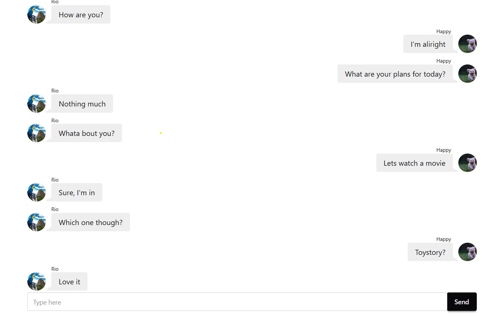
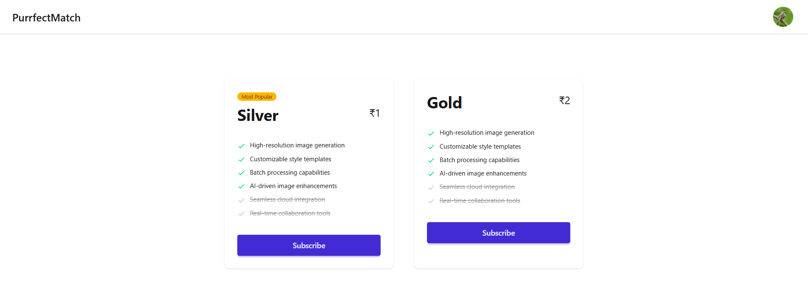

# 🐾 PurrfectMatch – A Social Media Platform for Pets

**PurrfectMatch** is a fun and interactive social media app that allows pets (via their owners) to make friends, send or receive friend requests, and build their own pet connection network. Designed with love using the MERN stack and deployed on AWS EC2 with Nginx for scalability.

---

## 🚀 Features

* 🔍 **Search for Pet Friends** – Browse and find pets by name or type.
* 🤝 **Friend Requests** – Send, accept, or decline requests to connect with other pets.
* 📇 **Connections Page** – View all accepted friends in a neat, organized interface.
*    **Chat with Connections** - Chat with your connections in real time.
* 🐕 **Pet Profiles** – Basic profile management for each pet (e.g., name, breed, bio).

---

## 🛠️ Tech Stack

* **Frontend:** React.js, Tailwind CSS (optional), socket.io/client
* **Backend:** Node.js, Express.js, socket.io
* **Database:** MongoDB (Atlas or self-hosted)
* **Authentication:** JWT-based Auth
* **Deployment:**

  * **Server:** AWS EC2 (Ubuntu)
  * **Web Server & Reverse Proxy:** Nginx
  * **Process Manager:** PM2

---

## 📸 Screenshots


Profile of logged in user:


logged in User can update his/her profile:


logged in User can browse through feed and send friend request or ignore the card:


logged in User can accpet/decline friend request:


Logged in user can view connections:


Logged in user can chat with connections in real time:


Logged in user can subscribe to premium:

---

---

## 📁 Project Structure

```

https://aditis.in/      → React frontend  
https://aditis.in/api    → Express backend API  

```

---

## ⚙️ Setup Instructions

### Prerequisites

* Node.js & npm
* MongoDB URI
* AWS EC2 instance (Ubuntu)
* Nginx installed
* Domain name (optional)


### 1. Backend Setup

```bash
git clone https://github.com/AditiKulkarni1697/Purrfect-Match.git
npm install
touch .env   # Add your MONGO_URI and JWT_SECRET
npm run start
```

### 3. Frontend Setup

```bash
git clone https://github.com/AditiKulkarni1697/Purrfect_Match_Frontend.git
npm install
npm run build
```

### 4. Deploy with Nginx & PM2 (on EC2)

* Upload your build folder to `/var/www/html`
* Setup Nginx config
* Use PM2 to run backend server


## 🧪 API Endpoints

Postman link to access api endpoints:
https://shorturl.at/dGvOH
---


## 🙋‍♀️ Author

**Aditi Sujlegaonkar**
[GitHub](https://github.com/AditiKulkarni1697) | [LinkedIn](https://www.linkedin.com/in/aditi-sujlegaonkar/)

---

## 🐞 Contributing / Reporting Issues

Feel free to open a pull request or issue. Suggestions and improvements are welcome!


